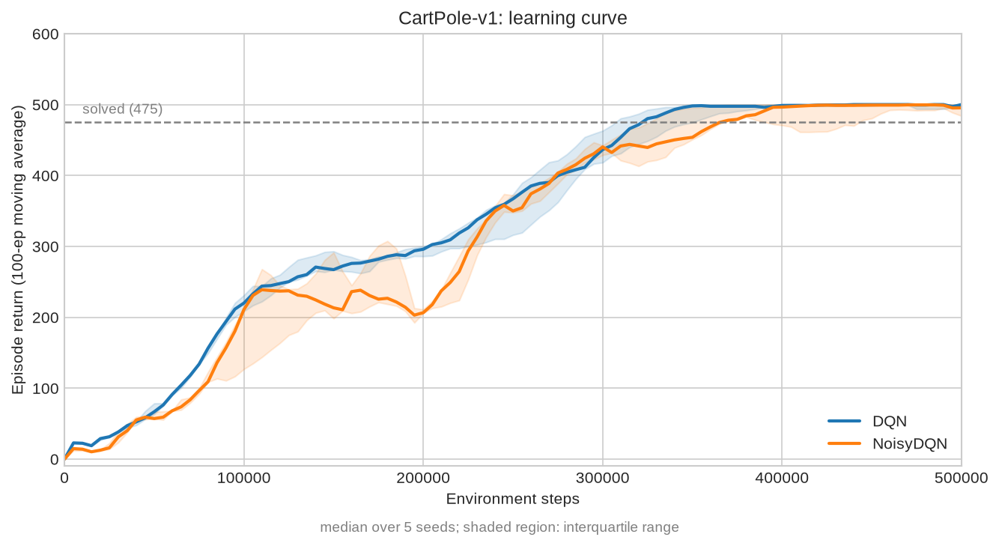
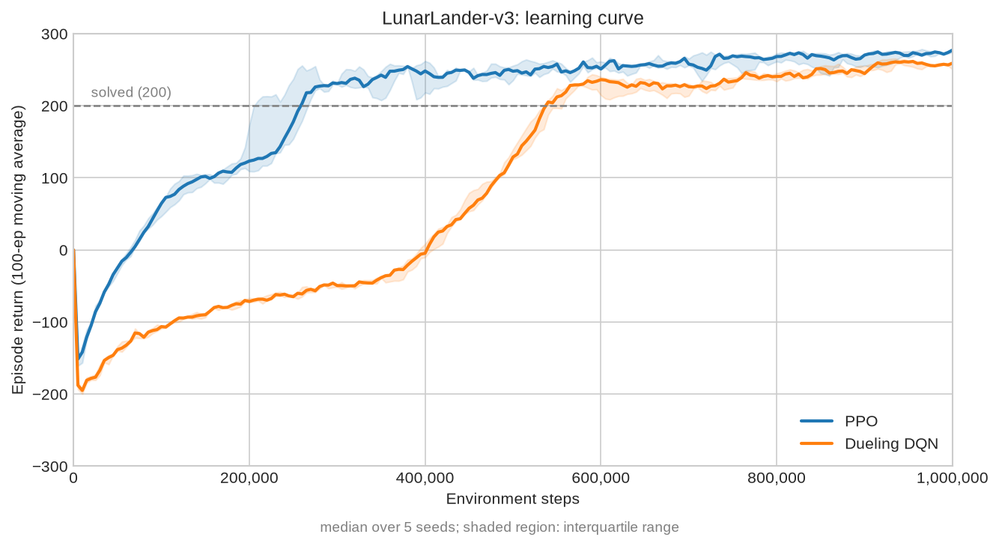

# BAKE
[](#license)

Bake is a reinforcement learning framework written from scratch in Rust, using [Burn](https://burn.dev/). Created to study reinforcement learning algorithms and their implementation details.

## Training Sanity Checks
Following experiments verifies that the implemented algorithms learn reliably.
### DQN with PER and NoisyNet-DQN with PER on native Rust CartPole-v1

Codes:
- [DQN with PER](crates/bake-deep/examples/dqn_test.rs)
- [NoisyNet-DQN with PER](crates/bake-deep/examples/noisy_dqn_test.rs)
- [Plot](docs/scripts/cartpole.py)
### PPO and Dueling DQN on Gymnasium LunarLander-v3

Codes:
- [PPO](crates/bake-gym/examples/ppo_lunarlander.rs)
- [Dueling DQN with PER](crates/bake-gym/examples/dueling_dqn_lunarlander.rs)
- [Plot](docs/scripts/lunarlander.py)

## Features
### Tabular RL
#### Algorithms
|Algorithm|Implementation|
|:---:|:---:|
|Q-Learning|[qlearning.rs](crates/bake-tabular/src/algorithm/qlearning.rs)|
|Sarsa|[sarsa.rs](crates/bake-tabular/src/algorithm/sarsa.rs)|
|n-step Q-Learning|[nstep_qlearning.rs](crates/bake-tabular/src/algorithm/nstep_qlearning.rs)|
|n-step Sarsa|[nstep_sarsa.rs](crates/bake-tabular/src/algorithm/nstep_sarsa.rs)|

For the n-step Q-learning, user can choose one of two methods, tree-backup method and importance sampling method.

#### Environments
|Environment|Explanation|Implementation|
|:---:|:---:|:---:|
|`CliffWalking`|A classic S & B grid world|[cliff_walking.rs](crates/bake-tabular/src/env/cliff_walking.rs)|
|`MaskedCliffWalking`|A grid world with mask on the boundaries|[masked_cliff_walking](crates/bake-tabular/src/env/masked_cliff_walking.rs)|

#### Exploration Strategies
- greedy
- epsilon greedy
- Boltzmann

### Deep RL
#### Algorithms
|Algorithm|Implementation|
|:---:|:---:|
|DQN|[dqn.rs](crates/bake-deep/src/algorithm/dqn.rs)|
|Double DQN|[double_dqn.rs](crates/bake-deep/src/algorithm/double_dqn.rs)|
|REINFORCE|[reinforce.rs](crates/bake-deep/src/algorithm/reinforce.rs)|
|A2C|[a2c.rs](crates/bake-deep/src/algorithm/a2c.rs)|
|PPO|[ppo.rs](crates/bake-deep/src/algorithm/ppo.rs)|

<details>
<summary>Algorithm variants</summary>

**NoisyNet variant**
with `NoisyLinear`: [noisylinear.rs](crates/bake-deep/src/net/layer/noisy_linear.rs)

**DQN and Double DQN variants**
|Variant|Implementation|
|:---:|:---:|
|Dueling|with `DiscreteDuelingQNet`|
|Prioritized Experience Replay|with `ReplayBufferConfig::prioritized()`|
</details>

#### Environments
Native Rust:

These are pure Rust environments.
|Environment|Explanation|Implementation|
|:---:|:---:|:---:|
|`CartPole`|Modeled after [Gymnasium](https://gymnasium.farama.org)'s CartPole-v1|[cartpole.rs](crates/bake-deep/src/env/cartpole.rs)|
|`CliffWalking`|The one-hot encoded version of tabular environment `CliffWalking`|[cliffwalking.rs](crates/bake-deep/src/env/cliffwalking.rs)|
|`MaskedCliffWalking`|The one-hot encoded version of tabular environment `MaskedCliffWalking`|[masked_cliffwalking.rs](crates/bake-deep/src/env/masked_cliffwalking.rs)|

Gymnasium Binding:

These are environments which runs python interpreters internally. Binded with PyO3.
|Environment|Explanation|Implementation|
|:---:|:---:|:---:|
|`GymCartPole`|CartPole-v1 of Gymnasium|
|`GymMountainCar`|MountainCar-v0 of Gymnasium|
|`GymAcrobot`|Acrobot-v1 of Gymnasium|
|`GymLunarLander`|LunarLander-v3 of Gymnasium|
|`GymCliffWalking`|one-hot encoded CliffWalking-v1 of Gymnasium|
|`GymTaxi`|one-hot encoded Taxi-v4 of Gymnasium|
|`GymFrozenLake`|one-hot encoded FrozenLake-v1 of Gymnasium|

#### Exploration Strategies
- greedy
- epsilon greedy
- Boltzmann
- NoisyNet

## Quick Start
To use Gymnasium environments, python virtual environment is required. This project uses [uv](https://docs.astral.sh/uv/).
```bash
git clone https://github.com/joonjoon0425/bake.git
cd bake
cargo run --release --example qlearning_test
cargo run --release --example ppo_test
uv sync
source .venv/bin/activate
cargo run --release --example ppo_lunarlander
```
<details>
<summary>Total example lists</summary>

#### Tabular RL
|Example name|Environment|Code|
|:---:|:---:|:---:|
|qlearning_test|`MaskedCliffWalking`|[code](crates/bake-tabular/examples/qlearning_test.rs)|
|sarsa_test|`CliffWalking`|[code](crates/bake-tabular/examples/sarsa_test.rs)|
|nstep_qlearning_test|`CliffWalking`|[code](crates/bake-tabular/examples/nstep_qlearning_test.rs)|
|nstep_sarsa_test|`MaskedCliffWalking`|[code](crates/bake-tabular/examples/nstep_sarsa_test.rs)|

#### Deep RL: Native Rust Environments
|Example name|Environment|Code|
|:---:|:---:|:---:|
|dqn_test|`CartPole`|[code](crates/bake-deep/examples/dqn_test.rs)|
|noisy_dqn_test|`CartPole`|[code](crates/bake-deep/examples/noisy_dqn_test.rs)|
|reinforce_test|`CartPole`|[code](crates/bake-deep/examples/reinforce_test.rs)|
|a2c_test|`CartPole`|[code](crates/bake-deep/examples/a2c_test.rs)|
|ppo_test|`CartPole`|[code](crates/bake-deep/examples/ppo_test.rs)|
|tabular_test|`MaskedCliffWalking`|[code](crates/bake-deep/examples/tabular_test.rs)|

#### Deep RL: Gymnasium Environments
|Example name|Environment|Code|
|:---:|:---:|:---:|
|dqn_taxi|`GymTaxi`|[code](crates/bake-gym/examples/dqn_taxi.rs)|
|dqn_mountaincar|`GymMountainCar`|[code](crates/bake-gym/examples/dqn_mountaincar.rs)|
|dqn_frozenlake|`GymFrozenLake`|[code](crates/bake-gym/examples/dqn_frozenlake.rs)|
|a2c_cartpole|`GymCartPole`|[code](crates/bake-gym/examples/a2c_cartpole.rs)|
|dueling_dqn_lunarlander|`GymLunarLander`|[code](crates/bake-gym/examples/dueling_dqn_lunarlander.rs)|
|ppo_lunarlander|`GymLunarLander`|[code](crates/bake-gym/examples/ppo_lunarlander.rs)|

</details>

## License
Licensed under the [MIT License](LICENSE).