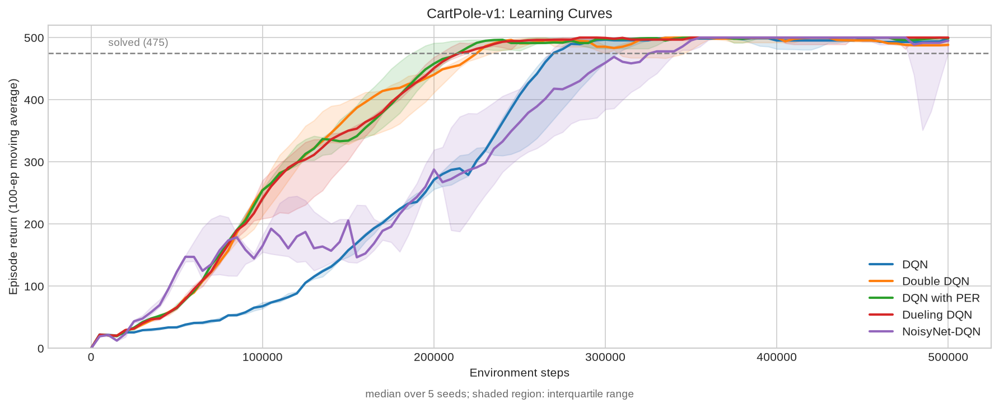
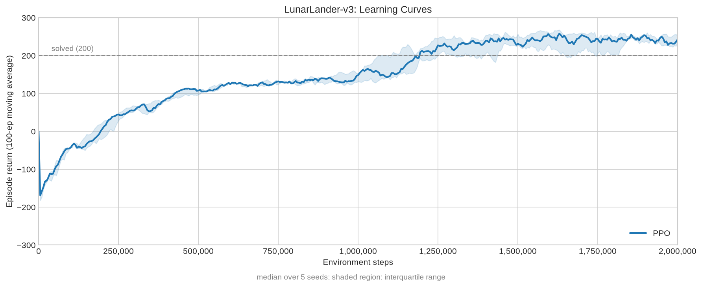

# BAKE
[](#license)

BAKE is a reinforcement learning framework written from scratch in Rust, using [Burn](https://burn.dev/).
It was created to study reinforcement learning algorithms and their
implementation details.

## Training Sanity Checks
The following experiments verify that the implemented algorithms learn reliably.
#### DQN variants on CartPole-v1

Summary
| algorithm    | steps to 475   | solved seeds   |   final return |   maximum q mean |
|:-------------|:---------------|:---------------|---------------:|-----------------:|
| DQN          | 270k           | 5 / 5          |          493.8 |            244.9 |
| Double DQN   | 230k           | 5 / 5          |          489.8 |            102.2 |
| DQN with PER | 215k           | 5 / 5          |          497.3 |            103.9 |
| Dueling DQN  | 215k           | 5 / 5          |          500   |            105.8 |
| NoisyNet-DQN | 330k           | 5 / 5          |          490.7 |            106.3 |

Hyperparameters
|$\gamma$|$\varepsilon$|loss function|optimizer|lr|warmup|update frequency|sync frequency|batch size|buffer capacity|$\alpha$ (for PER)|$\beta$ (for PER)|
|:---:|:---:|:---:|:---:|:---:|:---:|:---:|:---:|:---:|:---:|:---:|:---:|
|0.99|1.0 -> 0.05, linearly, from step 0 to 250000|MSE|Adam|2.5e-4|10000|10|500|128|10000|0.3|0.4 -> 1.0|

#### PPO on LunarLander-v3


Hyperparameters
|$\gamma$|$\lambda$|clip $\epsilon$|loss function|entropy coefficient|rollout size|minibatch size|epoch|optimizer|
|:---:|:---:|:---:|:---:|:---:|:---:|:---:|:---:|:---:|
|0.99|0.95|0.1|Huber loss with $\delta$=10.0|0.05 -> 0.008 linearly, from step 0 to 1250000|2048|256|10|Adam|

For more information, see [PPO configuration file](crates/bake/configs/gymenv/ppo_lunarlander.json) and [PPO code](crates/bake/examples/gymenv/gym_lunarlander_ppo.rs)

#### Reproduction
##### DQN Variants
Training Examples
- [DQN](crates/bake/examples/deep/dqn.rs)
- [Double DQN](crates/bake/examples/deep/ddqn.rs)
- [DQN with PER](crates/bake/examples/deep/dqn_per.rs)
- [Dueling DQN](crates/bake/examples/deep/dueling_dqn.rs)
- [NoisyNet-DQN](crates/bake/examples/deep/noisy_dqn.rs)

Plotting Script: [script](docs/dqn-algs-compare.py)
##### PPO
Configuration: [configuration](crates/bake/configs/gymenv/ppo_lunarlander.json)  
Training Example: [example](crates/bake/examples/gymenv/gym_lunarlander_ppo.rs)  
Plotting Script: [script](docs/lunarlander_ppo.py)

## Tabular
### Algorithms
|Algorithm|Implementation|
|:---:|:---:|
|Q-Learning|[qlearning.rs](crates/bake-tabular/src/agent/qlearning.rs)|
|Sarsa|[sarsa.rs](crates/bake-tabular/src/agent/sarsa.rs)|
|Expected Sarsa|[expected_sarsa.rs](crates/bake-tabular/src/agent/expected_sarsa.rs)|
|n-step Sarsa|[nstepsarsa.rs](crates/bake-tabular/src/agent/nstepsarsa.rs)|
|n-step Q-Learning with tree-backup method|[nstepqlearning.rs](crates/bake-tabular/src/agent/nstepqlearning.rs)|
### Environments
- `GridWorld`
- `Blackjack`
- `MaskedGridWorld`
### Exploration Strategies
- $\varepsilon$-greedy

## Deep
### Algorithms
|Algorithm|Implementation|
|:---:|:---:|
|DQN|[dqn.rs](crates/bake-deep/src/algorithm/dqn.rs)|
|Double DQN|[double_dqn.rs](crates/bake-deep/src/algorithm/double_dqn.rs)|
|REINFORCE|[vpg.rs](crates/bake-deep/src/algorithm/vpg.rs)|
|A2C|[a2c.rs](crates/bake-deep/src/algorithm/a2c.rs)|
|PPO|[ppo.rs](crates/bake-deep/src/algorithm/ppo.rs)|

<details>
<summary>Algorithm Extensions</summary>

**DQN and Double DQN extensions**

|Extension|Implementation|
|:---:|:---:|
|Dueling|with `DuelingQNet`|
|Priortized Experience Replay|with `PrioritizedExperienceReplayBuffer`|
|NoisyNet|with `NoisyLinear`|

</details>

### Environments
- Native `CartPole` modeled after [Gymnasium](https://gymnasium.farama.org)'s CartPole-v1
- Gymnasium Environment Bindings with PyO3. More environments will be supported later.
    - `GymnasiumEnv<CartPoleInfo>`: CartPole-v1
    - `GymnasiumEnv<MountainCarInfo>`: MountainCar-v0
    - `GymnasiumEnv<AcrobotInfo>`: Acrobot-v1
    - `GymnasiumEnv<LunarLanderInfo>`: LunarLander-v3

### Exploration Strategies
- $\varepsilon$-greedy
- Boltzmann
- NoisyNet

## Examples
```bash
git clone https://github.com/joonjoon0425/bake.git
cd bake
cargo run --release --example qlearning
cargo run --release --example ppo
uv sync
# activate your virtual environment
source .venv/bin/activate
cargo run --release --example gym_lunarlander_ppo
```
<details>
<summary>Total example lists</summary>


#### Tabular
|Example Name|Environment|
|:---:|:---:|
|qlearning|`GridWorld`|
|sarsa|`MaskedGridWorld`|
|expected_sarsa|`MaskedGridWorld`|
|nstepsarsa|`Blackjack`|
|nstepqlearning|`GridWorld`|

#### Deep: Gymnasium Environments
|Example Name|Environment|Explanation|
|:---:|:---:|:---:|
|gym_acrobot_a2c|`GymnasiumEnv<AcrobotInfo>`|A2C on Acrobot-v1|
|gym_cartpole_dqn|`GymnasiumEnv<CartPoleInfo>`|DQN on CartPole-v1|
|gym_lunarlander_dqn_per|`GymnasiumEnv<LunarLanderInfo>`|DQN on LunarLander-v3 with PER|
|gym_lunarlander_ppo|`GymnasiumEnv<LunarLanderInfo>`|PPO on LunarLander-v3|
|gym_mountaincar_dqn_per|`GymnasiumEnv<MountainCarInfo>`|DQN on MountainCar-v0 with PER|

#### Deep: Native Environments (Currently only CartPole)
|Example Name|Environment|Explanation|
|:---:|:---:|:---:|
|dqn|`CartPole`|Classic DQN with CartPole|
|ddqn|`CartPole`|Double DQN|
|dueling_dqn|`CartPole`|Dueling DQN|
|dqn_per|`CartPole`|DQN with PER|
|noisy_dqn|`CartPole`|Noisy-DQN|
|dueling_ddqn_per|`CartPole`|Dueling Double DQN with PER|
|vpg|`CartPole`|REINFORCE|
|a2c|`CartPole`|A2C|
|noisy_a2c|`CartPole`|Noisy-A2C|
|equivariant_a2c|`CartPole`|A2C with Z2-symmetric network|
|ppo|`CartPole`|PPO|
|equivariant_ppo|`CartPole`|PPO with Z2-symmetric network|
</details>

Example codes can be found [here](crates/bake/examples/).

## License

Licensed under the [MIT License](LICENSE).